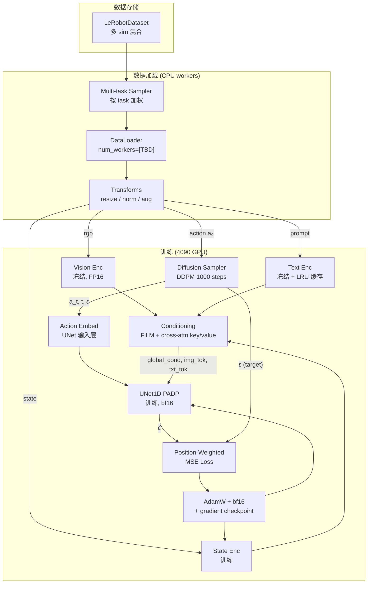
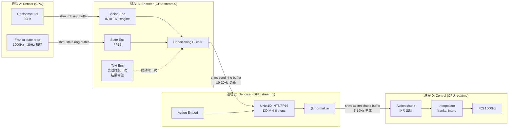
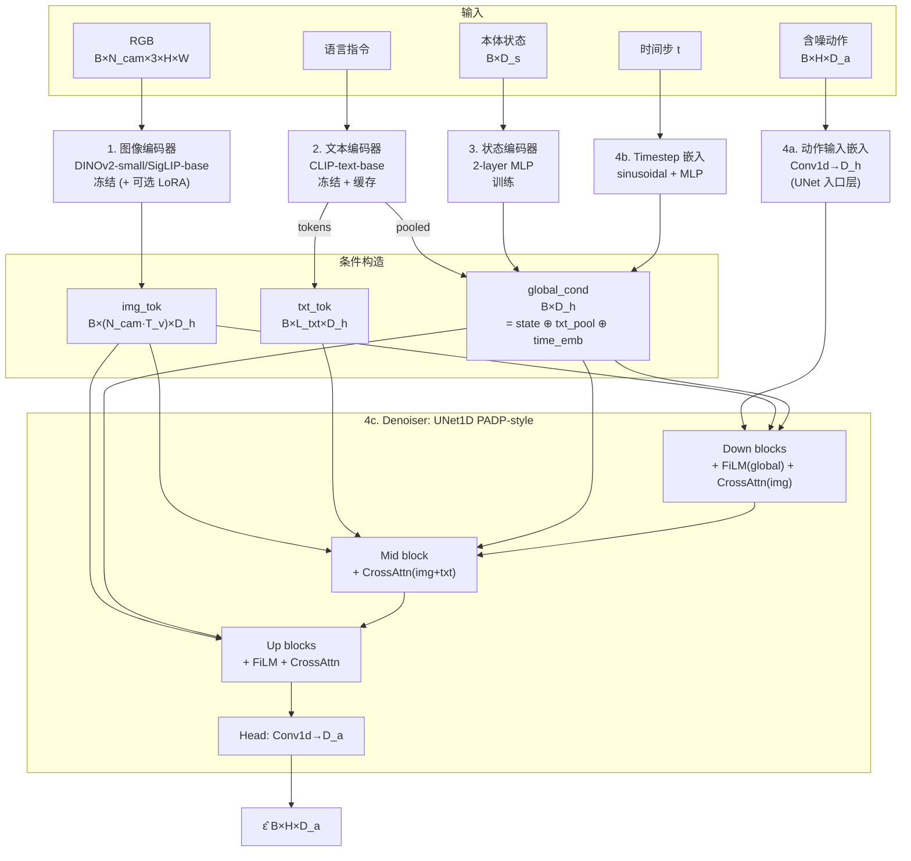

# PADP 重构与多环境落地方案

> **文档定位**:协作迭代的工作底稿,不是最终交付物。每节都按"模块"组织,可独立修改、增删、重排。决策点用 `[TBD]` 标出。
>
> **协作约定**
> - 已对齐的写在正文。
> - 没敲定的写 `[TBD: 候选 A / 候选 B / ...]`,并在 [§11 决策清单](#11-待定决策清单) 汇总。
> - 每轮迭代后在 [§修订记录](#修订记录) 加一行。

---

> **已归档 · 内容已被 [落地方案v4-1.md](落地方案v4-1.md) 取代**
>
> 本文件是早期重构版本,设计思路与现行 7-Layer DDD 规范(详见 [落地方案v4.md](落地方案v4.md))不完全一致。
> 当前阶段 1 实施以 **v4-1** 为准(60 文件,7 铁律,带 EMA)。
> 本文件仅作历史保留。

## 0. 目录

- [1. 总体目标与约束](#1-总体目标与约束)
- [2. 设备连接图](#2-设备连接图)
- [3. 数据流图](#3-数据流图)
- [4. 模型架构](#4-模型架构)
- [5. 代码架构](#5-代码架构)
- [6. 加速思路](#6-加速思路)
- [7. 多环境矩阵](#7-多环境矩阵)
- [8. 接口契约](#8-接口契约)
- [9. 里程碑与验证](#9-里程碑与验证)
- [10. 风险与回退](#10-风险与回退)
- [11. 待定决策清单](#11-待定决策清单)
- [修订记录](#修订记录)

---

## 1. 总体目标与约束

### 1.1 项目目标

把 [PADP](../../PADP/PADP代码结构与功能.md) 现有"单 task / 单仿真 / 单 env"的代码结构,重构成**"一份模型 + 多个仿真同时训练 + 真机部署"的统一架构**,关键能力借鉴 [GuidedVLA](../../GuidedVLA/PI0_PI05代码结构与功能.md) 的:
- 跨 sim 统一数据格式(LeRobot)
- 多模态条件(图像 + 文本 + 状态)
- server/client 分离的部署形态

但**保留 PADP 的核心创新**:
- Position-aware 加权(per-horizon 位置 loss / weight 曲线)
- 1D Conditional UNet 作为 denoiser
- DDIM/DPM-Solver 少步推理

### 1.2 硬件约束

| 角色 | 硬件 | 显存 | 用途 |
|---|---|---|---|
| 训练机 | RTX 4090 | 24 GB | 训练 + 大 batch 评估 |
| 部署机 | RTX 4070 或 RTX 4060 | 12 GB / 8 GB | 真机推理 server |
| 真机 | Franka Emika `[TBD: Panda / FR3]` | — | 受 4070/4060 通过 libfranka 控制 |
| 相机 | Realsense `[TBD: D415 / D435 ×2]` | — | USB3.0 直连部署机 |

### 1.3 多环境拆分动机

单一 Python env 无法同时满足:
1. 训练用最新 PyTorch + transformers + lerobot;
2. 多个仿真(robomimic / mimicgen / pusht / kitchen / `[TBD: LIBERO?]`)各自需要不兼容的 mujoco / gym 版本;
3. 真机 libfranka + Realsense SDK 需要 Linux 系统级依赖;
4. 部署推理需要 TensorRT / ONNX runtime,跟训练栈版本不一定一致。

→ **以"功能"为单位拆环境,通过明确接口通信**。详见 [§7 多环境矩阵](#7-多环境矩阵)。

### 1.4 本方案明确不做的事

- 不迁 JAX/Flax(论据见之前讨论:单 GPU + diffusion + 定制 weight,JAX 红利不命中)。
- 不上 Gemma/PaliGemma 量级的 VLM 主干(4060 显存装不下)。
- 不做 TPU/多机训练。
- 不做 sim2real domain randomization 框架级支持(超出本期范围)。

---

## 2. 设备连接图

### 2.1 训练阶段(单机)

```
                      ┌─────────────────────────┐
                      │  训练机 (Workstation)   │
                      │  ─────────────────────  │
                      │  CPU:  [TBD]            │
                      │  RAM:  [TBD: ≥64GB?]    │
                      │  GPU:  RTX 4090 24GB    │
                      │  Disk: NVMe ≥ 2TB       │
                      │                         │
                      │  conda env: padp-train  │
                      └──────────┬──────────────┘
                                 │
                                 │ (本地 NVMe / NAS 挂载)
                                 ▼
                      ┌─────────────────────────┐
                      │  数据存储                │
                      │  LeRobotDataset (parquet│
                      │   + mp4) + zarr 备份     │
                      └─────────────────────────┘
```

**说明**:训练阶段无外设,只有数据 IO。

### 2.2 部署阶段(机械臂端)

```
                          ┌──────────────────────────┐
                          │   部署机 (Arm Host)      │
                          │   ──────────────────     │
                          │   GPU: 4070 12GB         │
                          │      或 4060 8GB         │
                          │                          │
                          │   conda env ×3:          │
                          │   - encoder              │
                          │   - denoiser             │
                          │   - control              │
                          │                          │
                          │   IPC: shared memory     │
                          └──┬──────────┬────────────┘
                             │          │
              USB3 ×2        │          │  Ethernet 1Gbps
            ┌────────────────┘          └─────────────────┐
            │                                              │
            ▼                                              ▼
   ┌────────────────────┐                       ┌──────────────────┐
   │ Realsense ×N_cam   │                       │  Franka Control  │
   │ [TBD: 2 个?哪型号] │                       │  Box (FCI 1kHz)  │
   │ 30fps RGB+depth?   │                       │                  │
   └────────────────────┘                       └────────┬─────────┘
                                                         │
                                                         ▼
                                                ┌──────────────────┐
                                                │   Franka Arm     │
                                                │   + Gripper      │
                                                │   [TBD: 型号]     │
                                                └──────────────────┘
```

**关键链路时序**:

| 链路 | 物理介质 | 带宽要求 | 延迟预算 |
|---|---|---|---|
| Realsense → 部署机 | USB 3.0 | ~200 MB/s @ 2×30fps RGB | < 5 ms |
| 部署机 ↔ Franka Control Box | 千兆以太网 | 极小 | < 1 ms(实时) |
| Franka Control Box → 机械臂 | EtherCAT 内置 | — | < 1 ms |

### 2.3 训练机 ↔ 部署机 关系

- **不要求联机**。训练在 workstation 完成后,checkpoint 通过 `[TBD: scp / rsync / 共享目录]` 同步到部署机。
- checkpoint 同时带 `model.safetensors` + `norm_stats.json` + `config.yaml`,格式见 [§8.3](#83-checkpoint-格式)。

### 2.4 仿真阶段(训练机上同机起 sim)

仿真训练/评估都在训练机上跑,但 sim 进程跟训练进程**通过 IPC 解耦**(原因:不同 sim 的 mujoco 版本冲突):

```
┌────────────────────────────────────────────────────────────────┐
│  训练机 4090                                                    │
│                                                                 │
│  ┌──────────────────┐    websocket    ┌──────────────────────┐ │
│  │ padp-train env   │ ◄─────────────► │ sim env (per-sim)    │ │
│  │ - 模型 + denoiser│                 │ - robomimic / kitchen│ │
│  │ - encoder server │                 │ - pusht / blockpush  │ │
│  │ (eval 时启动)    │                 │ - [TBD: LIBERO?]     │ │
│  └──────────────────┘                 └──────────────────────┘ │
└────────────────────────────────────────────────────────────────┘
```

详见 [§7.2 评估时的 sim env 启动方式](#72-评估时的-sim-env-启动方式)。

---

## 3. 数据流图

### 3.1 训练阶段数据流



**Tensor shape 范例**(`B=32, N_cam=2, H_img=224, H=16 horizon, D_a=10, D_h=512`):

| 节点 | shape | dtype |
|---|---|---|
| `rgb` | `[32, 2, 3, 224, 224]` | uint8 → bf16 |
| `prompt` | `list[str]` len=32 | — |
| `state` | `[32, 14]` | fp32 → bf16 |
| `action a₀` | `[32, 16, 10]` | fp32 → bf16 |
| `img_tok` | `[32, 2×196, 512]` | bf16 |
| `txt_tok` | `[32, L_txt, 512]` | bf16 |
| `txt_pool` | `[32, 512]` | bf16 |
| `global_cond` | `[32, 512]` | bf16 |
| `a_t` | `[32, 16, 10]` | bf16 |
| `t` | `[32]` | int64 |
| `ε̂` | `[32, 16, 10]` | bf16 |
| `loss` | `[]` (scalar) | fp32 |

### 3.2 部署阶段数据流(多进程)



**频率与延迟预算**:

| 进程 | 频率 | 单次 latency 预算 | 4060 实测目标 |
|---|---|---|---|
| A 采集 | 30 Hz | 33 ms | ✓ Realsense 上限 |
| B 编码器 | 10–20 Hz | < 50 ms | DINOv2-small INT8 |
| C 去噪 | 10 Hz(出 chunk)/ 内部 1 Hz × 单步 4–6 ms | < 30 ms / chunk | DDIM 4 步 + UNet INT8 |
| D 控制下发 | 1000 Hz | < 1 ms | CPU 实时线程 |

**关键设计**:进程 C 一次生成 `H=16` 步 action chunk,进程 D 按 1000Hz 逐步插值下发,使**控制实时性与去噪频率解耦**。这是延续 PADP [diffusion_policy/real_world/real_inference_util.py](../../PADP/diffusion_policy/real_world/real_inference_util.py) 的成熟模式。

### 3.3 评估阶段数据流(sim)

```
┌────────────────────────────┐    websocket   ┌────────────────────────────┐
│ padp-train env             │ ◄────────────► │ sim env (e.g. robomimic)   │
│  - Encoder (常驻 GPU)      │   msgpack-     │  - mujoco / gym            │
│  - Denoiser (常驻 GPU)     │   numpy        │  - env_runner              │
│  - PolicyServer            │                │  - 收 action → step env    │
└────────────────────────────┘                │  - 发 obs → 等 action      │
                                              └────────────────────────────┘
```

跟 GuidedVLA [scripts/serve_policy.py](scripts/serve_policy.py) + [packages/openpi-client](packages/openpi-client) 同形态。

---

## 4. 模型架构

### 4.1 四个核心模块



### 4.2 模块间交互模式速查

| 来源 | 流向 denoiser 的方式 | 理由 |
|---|---|---|
| `global_cond`(state + text_pool + time) | **FiLM**(每个 ResBlock 做 scale/shift) | 几乎零额外参数,全 layer 影响 |
| `img_tok`(空间细节) | **Cross-attention**(query 来自 horizon 序列) | 让 horizon 上每个位置自己挑像素 |
| `txt_tok`(细粒度短语) | **Cross-attention**(只在 mid block) | 节省算力,语义级对齐 |
| `noisy action a_t` | **作为 UNet 输入**经 Conv1d 嵌入 | 标准 diffusion 写法,沿用 PADP |
| `position weight` | **作用在 loss**(不是模型结构) | 训练阶段乘 per-horizon 权重 |

### 4.3 与 PADP / GuidedVLA 既有代码的映射

| 新模块 | 复用来源 | 备注 |
|---|---|---|
| Vision Enc | [diffusion_policy/model/task_padp/dinov3_timm_obs_encoder.py](../../PADP/diffusion_policy/model/task_padp/dinov3_timm_obs_encoder.py) | 改 DINOv2-small 即可,接口保留 |
| Text Enc | [diffusion_policy/model/task_padp/multi_image_obs_encoder_clip.py](../../PADP/diffusion_policy/model/task_padp/multi_image_obs_encoder_clip.py) | 取其 CLIP-text 部分 |
| State Enc | 新写,~30 行 | 2-layer MLP |
| Denoiser | [diffusion_policy/model/diffusion/conditional_unet1d_padp.py](../../PADP/diffusion_policy/model/diffusion/conditional_unet1d_padp.py) | 加 cross-attn 入口(目前主要靠 FiLM 走 global_cond) |
| Loss / weight | [diffusion_policy/policy/schedulers_padp.py](../../PADP/diffusion_policy/policy/schedulers_padp.py) | 不动 |
| Server/Client | 参考 GuidedVLA [src/openpi/serving/websocket_policy_server.py](src/openpi/serving/websocket_policy_server.py) + [packages/openpi-client/src/openpi_client/websocket_client_policy.py](packages/openpi-client/src/openpi_client/websocket_client_policy.py) | 复刻协议 |
| LeRobot 数据 | 参考 GuidedVLA [src/openpi/training/data_loader.py](src/openpi/training/data_loader.py) + [examples/aloha_real/convert_aloha_data_to_lerobot.py](examples/aloha_real/convert_aloha_data_to_lerobot.py) | 数据转换写新 script |

### 4.4 模型尺寸预估

| 模块 | 参数量 | FP16 显存 | 训练时是否反向 |
|---|---|---|---|
| Vision Enc(DINOv2-small) | 22 M | 44 MB | ❌(冻结) |
| Text Enc(CLIP-text-base) | 63 M | 126 MB | ❌(冻结 + 缓存) |
| State Enc | < 1 M | 2 MB | ✅ |
| UNet1D + cross-attn | ~80 M `[TBD: 调整 D_h]` | 160 MB | ✅ |
| **小计参数** | **~165 M** | **~330 MB** | — |
| 训练激活(B=32) | — | ~4 GB | — |
| Optimizer state | — | ~640 MB | — |
| **训练总占用** | — | **~5 GB / 24 GB** | 富余 |
| 部署激活(B=1, INT8) | — | ~200 MB | — |
| **部署总占用** | — | **~400 MB / 8 GB** | 富余 |

---

## 5. 代码架构

### 5.1 新仓库目录结构(草案)

```
padp-vla/
├── pyproject.toml              # uv 管 Python 依赖
├── uv.lock
├── .python-version
├── conda/                      # 各 env 的 conda yaml
│   ├── train.yaml
│   ├── encoder.yaml
│   ├── denoiser.yaml
│   ├── control.yaml
│   └── sim/
│       ├── robomimic.yaml
│       ├── pusht.yaml
│       └── kitchen.yaml
├── src/
│   └── padp/
│       ├── __init__.py
│       ├── models/
│       │   ├── vision_encoder.py       # DINOv2-small wrapper
│       │   ├── text_encoder.py         # CLIP-text wrapper
│       │   ├── state_encoder.py
│       │   ├── unet1d_padp.py          # 改造自原 conditional_unet1d_padp.py
│       │   └── policy.py               # 顶层组装
│       ├── data/
│       │   ├── lerobot_dataset.py      # 多 task 混合
│       │   ├── transforms.py
│       │   ├── normalizer.py
│       │   └── conversion/             # 各源数据 → LeRobot
│       │       ├── robomimic_to_lerobot.py
│       │       ├── pusht_to_lerobot.py
│       │       └── franka_to_lerobot.py
│       ├── train/
│       │   ├── workspace.py            # 沿用 PADP base_workspace 思路
│       │   ├── losses.py               # position-weighted
│       │   ├── schedulers.py           # DDPM/DDIM
│       │   └── config/                 # Hydra yaml
│       ├── eval/
│       │   ├── multi_task_runner.py
│       │   └── runners/                # 每 sim 一个 runner adapter
│       ├── deploy/
│       │   ├── server/
│       │   │   ├── encoder_server.py   # 进程 B
│       │   │   ├── denoiser_server.py  # 进程 C
│       │   │   └── policy_server.py    # websocket 总入口(评估用)
│       │   ├── client/
│       │   │   ├── sensor_node.py      # 进程 A
│       │   │   └── control_node.py     # 进程 D
│       │   ├── ipc/
│       │   │   ├── shm_ring_buffer.py  # 同机
│       │   │   └── ws_protocol.py      # 跨机
│       │   └── quantize/
│       │       ├── export_onnx.py
│       │       └── build_trt_engine.py
│       └── shared/
│           ├── shape_meta.py           # 统一 schema
│           ├── checkpoint.py
│           └── logging.py
├── packages/
│   └── padp-client/                    # 可独立 pip 安装,用于 sim/真机端
│       ├── pyproject.toml
│       └── src/padp_client/
│           ├── policy_client.py
│           └── runtime.py
├── scripts/
│   ├── train.py                        # 训练入口
│   ├── eval_sim.py                     # 多 sim 评估入口
│   ├── serve_policy.py                 # 启动 deploy server
│   ├── convert_dataset.py
│   └── benchmark_deploy.py
├── examples/
│   ├── robomimic/                      # 各 sim adapter + main
│   ├── pusht/
│   ├── kitchen/
│   └── franka_real/
├── docs/
│   ├── deployment.md
│   ├── ipc_protocol.md
│   └── figures/
└── tests/
```

**与 PADP / GuidedVLA 的关系**:
- 大目录布局抄 GuidedVLA([src/openpi](src/openpi) + [packages](packages) + [examples](examples) + [scripts](scripts) 模式),但**内部模型代码沿用 PADP 的 1D UNet + position weight**。
- `padp-client` 独立子包 → 真机/sim 端只装它就够,不拖 transformers/torch。

### 5.2 模块边界与接口(初步)

| 模块 | 输入 | 输出 | 接口形式 |
|---|---|---|---|
| `vision_encoder.VisionEncoder` | `rgb: [B,N,3,H,W]` | `img_tok: [B,N·T_v,D_h]` | `forward()` |
| `text_encoder.TextEncoder` | `list[str]` | `(txt_tok, txt_pool)` | `encode()` + 内部 LRU |
| `state_encoder.StateEncoder` | `[B,D_s]` | `[B,D_h]` | `forward()` |
| `unet1d_padp.PADPUNet1D` | `a_t, t, global_cond, img_tok, txt_tok` | `[B,H,D_a]` | `forward()` |
| `policy.PADPPolicy` | obs dict | action chunk | `predict_action()` |
| `deploy.EncoderServer` | shm in | shm out (cond) | 守护进程 |
| `deploy.DenoiserServer` | shm in (cond) | shm out (action) | 守护进程 |
| `deploy.PolicyServer` | ws in (obs) | ws out (action) | 评估/远程推理 |

详细的 IPC payload schema 见 [§8 接口契约](#8-接口契约)。

### 5.3 改造路线:从 PADP 到 padp-vla 的迁移

不一次性推翻,分阶段迁:

```
PADP (原仓库)                          padp-vla (新仓库)
─────────────────                      ──────────────────
diffusion_policy/model/diffusion/  ──► src/padp/models/unet1d_padp.py
  conditional_unet1d_padp.py          (加 cross-attn 入口)

diffusion_policy/model/task_padp/  ──► src/padp/models/vision_encoder.py
  dinov3_timm_obs_encoder.py          (改 DINOv2-small)

diffusion_policy/policy/           ──► src/padp/models/policy.py
  PADP_diffusion_unet_image_policy.py  (顶层组装)

diffusion_policy/policy/           ──► src/padp/train/schedulers.py
  schedulers_padp.py                  (不动)

diffusion_policy/workspace/        ──► src/padp/train/workspace.py
  robomimic/train_padp_workspace_v3.py (按新 dataset 改 batch 处理)

diffusion_policy/dataset/          ──► src/padp/data/conversion/
  robomimic/replay_image_dataset_padp.py  robomimic_to_lerobot.py
                                        + src/padp/data/lerobot_dataset.py

diffusion_policy/env_runner/       ──► src/padp/eval/runners/
  robomimic_image_runner_padp.py        robomimic_runner.py

diffusion_policy/real_world/       ──► src/padp/deploy/client/
  *.py                                  control_node.py + sensor_node.py
```

---

## 6. 加速思路

### 6.1 训练侧(4090)

按预期收益排序:

| # | 优化项 | 预期收益 | 工作量 | 备注 |
|---|---|---|---|---|
| 1 | **Vision / Text encoder 冻结** | 显存 -50%, 训速 +30% | 极小 | 默认开启 |
| 2 | **bf16 mixed precision** | 显存 -40%, 训速 +60% | 小 | `torch.amp` |
| 3 | **冻结编码器特征离线缓存** | 训速 +2-3× | 中 | 整个 dataset 预跑一遍,存 token;代价 = 占盘 |
| 4 | **`torch.compile(unet)`** | 训速 +30-50% | 小 | 首次编译慢 |
| 5 | **Flash Attention 2** for cross-attn | 显存 -30%, 训速 +20% | 极小 | `scaled_dot_product_attention` 自动 |
| 6 | **Gradient checkpoint mid block** | 显存 -20% | 小 | batch 不够大时再开 |
| 7 | **大 batch + grad accumulation** | 收敛快 | 极小 | batch=64+ |
| 8 | **数据 IO 加速** | 训速 +10-30% | 中 | LeRobot mp4 解码 + tensorboard offload |
| 9 | **`[TBD: LoRA vision encoder]`** | 表征精度 ↑ | 中 | 仅在冻结性能瓶颈时开 |

### 6.2 部署侧(4070 / 4060)

```
推理 latency 拆解(4060 目标):
┌──────────────────────────────────────────────────────────────┐
│ 一次完整推理 (cond 更新 + denoise + 输出 chunk)               │
│                                                              │
│ Vision  ────────────  40ms  (INT8 DINOv2-small, 一次/100ms)   │
│ State   ──            1ms                                     │
│ Cond    ──            2ms                                     │
│ Denoise ──────       25ms  (DDIM 4 步 × ~6ms, INT8 UNet)     │
│ Post    ─             3ms                                     │
│ Total                ~70ms  → 出 chunk 频率 ~14Hz             │
│                                                              │
│ 但因为 chunk 长度 H=16, 实际控制 1000Hz 由插值器实现           │
└──────────────────────────────────────────────────────────────┘
```

| 优化项 | 收益 | 风险 |
|---|---|---|
| **Vision INT8 TensorRT** | latency -50% | 精度损失 ~1%(经验值)|
| **UNet INT8 / FP16 TRT** | latency -40% | INT8 校准数据要够 |
| **DDIM 50 → 4–6 步** | latency -10× | 成功率可能 -5%,需消融 |
| **Encoder server / Denoiser server 拆 stream** | 真并行,latency -20% | 调试成本 ↑ |
| **prompt cache** | 文本编码 = 0 | 仅单一任务时有效 |
| **action chunk 复用** | 出 chunk 频率可降到 5Hz | 控制平滑度 ↓ |

### 6.3 量化与编译路径(部署)

```
训练 (.safetensors, bf16)
    │
    │ scripts/convert_for_deploy.py
    ▼
PyTorch (.pt, fp32)  ─── A 路: torch.compile + INT8 dynamic quantize
    │                       (最快上手,latency 一般)
    │
    │ scripts/export_onnx.py
    ▼
ONNX (fp32)  ────────── B 路: ONNX Runtime + INT8
    │                       (中等)
    │
    │ scripts/build_trt_engine.py
    ▼
TensorRT engine (INT8)  C 路: TRT INT8 + 静态 shape
                            (最快,工作量最大)
```

**推荐路径**:**首版走 B 路(ONNX Runtime INT8)**,验证整体 latency 达标后再升 C 路。

### 6.4 加速验证基准

新建 [scripts/benchmark_deploy.py](scripts/benchmark_deploy.py),固定:
- 输入 `[1, 2, 3, 224, 224]` rgb,`[1, 14]` state,固定 prompt
- denoise 4 / 6 / 10 / 50 步对比
- 三种部署路径(A/B/C)对比
- 记录 latency(p50/p99)+ 显存占用 + 4 步成功率(sim 中验证)

每次优化提交前必须跑过这个 benchmark。

---

## 7. 多环境矩阵

### 7.1 环境一览

| env 名 | 管理器 | Python | 关键依赖 | 用途 | 部署在哪里 |
|---|---|---|---|---|---|
| `padp-train` | conda + uv | 3.11 | torch 2.x, transformers, lerobot | 训练 + 评估时的 server 端 | 训练机 4090 |
| `padp-encoder` | conda + uv | 3.11 | torch, tensorrt, onnxruntime-gpu | 部署进程 B | 部署机 4070/4060 |
| `padp-denoiser` | conda + uv | 3.11 | torch, tensorrt | 部署进程 C | 部署机 4070/4060 |
| `padp-control` | conda | 3.10 | libfranka, pyrealsense2 | 部署进程 A + D | 部署机 4070/4060 |
| `sim-robomimic` | conda | 3.9 | robomimic, mujoco 2.3, robosuite | 仿真评估 | 训练机 |
| `sim-pusht` | conda | 3.10 | pymunk, gym 0.21 | 仿真评估 | 训练机 |
| `sim-kitchen` | conda | 3.8 | dm_control, mujoco_py 老版 | 仿真评估 | 训练机 |
| `[TBD: sim-libero]` | conda | 3.8 | libero, mujoco 2.3 | 仿真评估 | 训练机 |
| `[TBD: sim-mimicgen]` | 复用 sim-robomimic | — | — | — | — |

### 7.2 评估时的 sim env 启动方式

模仿 GuidedVLA 的远程推理模式:

```bash
# 终端 1:训练机 padp-train env 启 server

> **已归档 · 内容已被 [落地方案v4-1.md](落地方案v4-1.md) 取代**
>
> 本文件是早期重构版本,设计思路与现行 7-Layer DDD 规范(详见 [落地方案v4.md](落地方案v4.md))不完全一致。
> 当前阶段 1 实施以 **v4-1** 为准(60 文件,7 铁律,带 EMA)。
> 本文件仅作历史保留。


conda activate padp-train
python scripts/serve_policy.py --ckpt outputs/xxx/checkpoint.pt --port 8000

# 终端 2:训练机 sim env 起评估
conda activate sim-robomimic
python examples/robomimic/main.py --host 127.0.0.1 --port 8000 --task square_d0 --n_test 50
```

多 sim 评估可以**串行**(同一 server,逐个 sim env 启动 client)或**并行**(开多端口,每个 sim 自己一个 server 实例)。`[TBD: 选哪种]`

### 7.3 conda + uv 混合策略

每个 env 都用相同模式:
1. `conda create -n <env_name>` + conda 装系统/二进制依赖(mujoco / libfranka / CUDA toolkit)
2. `conda env` 内 `pip install uv`
3. `uv pip sync conda/<env_name>.lock` 锁 Python 依赖

→ 同时拿到 conda 的二进制管理 + uv 的速度 + lockfile。

---

## 8. 接口契约

### 8.1 Shared memory ring buffer schema

复用 PADP [diffusion_policy/shared_memory/shared_memory_ring_buffer.py](../../PADP/diffusion_policy/shared_memory/shared_memory_ring_buffer.py)。每个 ring buffer 定义:

```python
# 进程 A → 进程 B: rgb_ring_buffer
{
    "rgb": np.ndarray,         # [N_cam, 3, H, W], uint8
    "timestamp": float,        # 采集时刻
    "frame_idx": int,
}

# 进程 A → 进程 B: state_ring_buffer
{
    "joint_pos": np.ndarray,   # [7], fp32
    "gripper": float,
    "timestamp": float,
}

# 进程 B → 进程 C: cond_ring_buffer
{
    "img_tok": np.ndarray,     # [1, N_cam·T_v, D_h], fp16
    "txt_tok": np.ndarray,     # [1, L_txt, D_h], fp16
    "global_cond": np.ndarray, # [1, D_h], fp16
    "obs_timestamp": float,    # 对应的 obs 时刻
}

# 进程 C → 进程 D: action_chunk_ring_buffer
{
    "actions": np.ndarray,     # [H, D_a], fp32 (已反 normalize)
    "start_timestamp": float,  # chunk 起始时刻
    "horizon_dt": float,       # 每步时长
}
```

### 8.2 Websocket 协议(评估 / 跨机)

参考 GuidedVLA [packages/openpi-client/src/openpi_client/msgpack_numpy.py](packages/openpi-client/src/openpi_client/msgpack_numpy.py):

```python
# client → server (obs)
{
    "rgb": {"cam_high": np.ndarray, "cam_wrist": np.ndarray},  # uint8
    "state": np.ndarray,
    "prompt": str,
}

# server → client (action)
{
    "actions": np.ndarray,    # [H, D_a]
    "info": {
        "infer_latency_ms": float,
        "denoise_steps": int,
    },
}
```

### 8.3 Checkpoint 格式

```
checkpoint/
├── model.safetensors          # 主权重
├── config.yaml                # 训练 config(含 model 超参)
├── norm_stats.json            # 每 task 的 normalizer 参数
├── tokenizer/                 # 文本 tokenizer assets(可选)
└── meta.json                  # commit hash, train date, dataset list
```

部署机加载只需 `model.safetensors` + `config.yaml` + `norm_stats.json`。

---

## 9. 里程碑与验证

### M1:单 sim 训练打通(2 周)

- [ ] 新仓库目录搭起来
- [ ] `padp-train` env(conda + uv)+ 一个 sim env(robomimic)
- [ ] `robomimic_to_lerobot.py` 转一个 task 的数据
- [ ] 训练能跑,position-weighted loss 曲线正常
- **验收**:square_d0 单 task 训 100 epoch,sim 评估 ≥ PADP 基线成功率的 90%

### M2:多 sim 混训(2 周)

- [ ] 多 task LeRobotDataset + 多 task 采样
- [ ] task_id embedding 加进 global_cond
- [ ] 多 task runner,一次评估扫所有 task
- **验收**:robomimic 3 个 task 混训一个模型,平均成功率 ≥ 单 task 训练的 95%

### M3:部署 server/client 原型(2 周)

- [ ] `EncoderServer` + `DenoiserServer` + shm ring buffer
- [ ] 同机上跑通 sim → server → action 完整链路
- [ ] benchmark 脚本就位
- **验收**:同机评估 latency ≤ 100ms / chunk

### M4:量化与 TensorRT(2 周)

- [ ] ONNX export
- [ ] INT8 校准
- [ ] TRT engine build
- **验收**:4060 上单次 chunk latency ≤ 70ms,成功率掉幅 ≤ 5%

### M5:真机部署(2 周)

- [ ] `control_node.py` + libfranka 整合
- [ ] `sensor_node.py` + Realsense
- [ ] 端到端真机闭环
- **验收**:Franka 上跑通至少 1 个任务,成功率 `[TBD: 阈值]`

### M6:文档与交付

- [ ] README + 部署说明
- [ ] 训练 / 评估 / 部署 命令清单
- [ ] 已知问题与回退路径

---

## 10. 风险与回退

| 风险 | 概率 | 影响 | 回退方案 |
|---|---|---|---|
| 4060 显存装不下 vision + denoiser 同时常驻 | 中 | 高 | 退到 4070;或拆机:4060 跑 encoder,另一台机跑 denoiser |
| INT8 后成功率掉幅 > 10% | 中 | 高 | 退 FP16;或只量化 vision,denoiser 保 FP16 |
| DDIM 4 步成功率不够 | 中 | 中 | 用 DPM-Solver++ 6 步;或保持 10 步,通过 chunk 长度补偿频率 |
| LeRobot mp4 解码慢成 IO 瓶颈 | 低 | 中 | 退 zarr;或预解码到 tensor 缓存 |
| 多 sim 混训互相干扰,某 task 反而退化 | 高 | 中 | 加 task-specific head(每 task 一个 output proj) |
| Franka FCI 与 denoiser 频率不匹配抖动 | 中 | 高 | 加大 action chunk;插值器加 outlier filter |
| 真机 vs sim 数据分布偏移 | 高 | 高 | 加真机数据继续训(LeRobot 格式直接拼)|
| conda 多 env 维护成本超预期 | 低 | 中 | 合并部署 env 为单 env(放弃部分 server 解耦) |
| 4090 训练时显存仍不够 | 低 | 中 | 开 gradient checkpoint + 降 D_h 到 384 |

---

## 11. 待定决策清单

汇总全文 `[TBD]`,等 PM/作者拍板:

| # | 决策项 | 候选 | 涉及章节 |
|---|---|---|---|
| 1 | Franka 型号 | Panda / FR3 | §1.2, §2.2 |
| 2 | Realsense 数量与型号 | D415 ×2 / D435 ×2 / 混合 | §1.2, §2.2 |
| 3 | 部署机选 4070 还是 4060 | 4070(舒服)/ 4060(成本)/ 都支持 | §1.2, §6 |
| 4 | 是否加入 LIBERO 作为 sim | 加 / 不加 | §1.3, §7.1 |
| 5 | Vision LoRA 微调 | 全冻结 / +LoRA rank=16 / 全量微调 | §4.1, §6.1 |
| 6 | 文本编码器粒度 | task_id only / CLIP-text full / Gemma-text | §4.1 |
| 7 | 训练数据走哪条路径 | 沿用 zarr / 迁 LeRobot / 两种并存 | §3.1, §5.3 |
| 8 | 部署 IPC 选型 | 纯 shm / 纯 websocket / 混合 | §3.2, §8 |
| 9 | 多 sim 评估串行还是并行 | 串行(简单)/ 并行(快) | §7.2 |
| 10 | 量化优先路径 | A(torch dynamic)/ B(ORT INT8)/ C(TRT) | §6.3 |
| 11 | UNet 隐藏维度 D_h | 384 / 512 / 768 | §4.4 |
| 12 | horizon 长度 H | 8 / 16 / 32 | §3.1, §4 |
| 13 | 真机部署成功率验收阈值 | `__%` | §9 M5 |
| 14 | 数据集存储路径(NAS / 本地 NVMe) | — | §2.1 |
| 15 | DDIM 步数 | 4 / 6 / 10 | §6.2 |

---

## 修订记录

| 日期 | 修订人 | 内容 |
|---|---|---|
| 2026-06-12 | Claude(初版骨架) | 按"设备连接图 + 数据流图 + 代码架构 + 加速思路"搭好骨架,把前期讨论的技术决策(DINOv2-small + CLIP-text + PADP UNet,4 进程拆分,LeRobot 数据,conda+uv 混合)填入;15 个待定项汇总到 §11 |
| | | |
